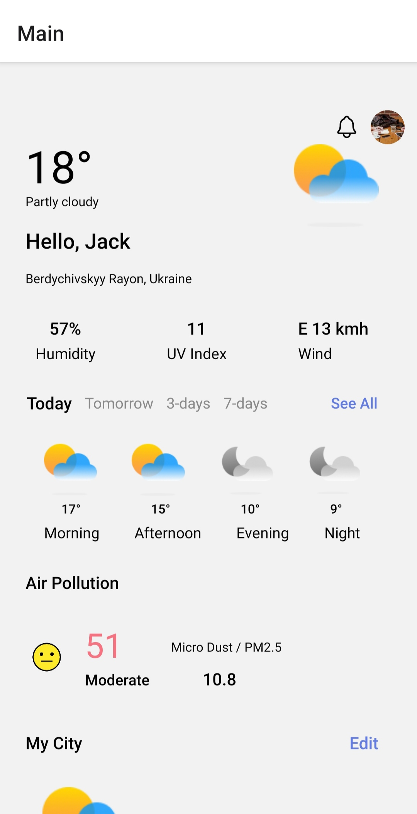
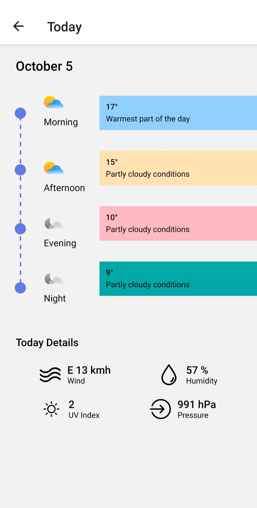

# Weather App

A cross-platform mobile weather app built with React Native and Expo. Automatically detects the user's location, shows current conditions and air quality, and lets users save and switch between multiple cities.

📱 **[Download APK](https://github.com/YOUR-USERNAME/YOUR-REPO/releases/download/v1.0.0/application-615961e3-56a6-40de-af3e-d9aa8d5ff4eb.apk)**

## Features

- **Automatic location detection** — uses native geolocation (`expo-location`) with proper permission handling, and reverse geocoding to resolve coordinates into a city name
- **Current weather & air quality** — pulls live data from the Open-Meteo API, including hourly and multi-day forecasts
- **Multi-city tracking** — save multiple cities and fetch their weather in parallel (`Promise.allSettled`), so a failed request for one city doesn't break the rest
- **Persistent local profile** — a lightweight onboarding flow stores the user's profile on-device with `AsyncStorage`
- **Fully typed** — 100% TypeScript codebase

## Tech Stack

- **Framework:** React Native, Expo
- **Language:** TypeScript
- **Navigation:** React Navigation (native-stack)
- **Storage:** AsyncStorage
- **APIs:** Open-Meteo (weather & air quality), BigDataCloud (reverse geocoding)
- **Location:** expo-location

## Architecture

The app is structured for a clean separation of concerns:

- `components/` — 11 reusable UI components
- `hooks/` — 7 custom hooks encapsulating data-fetching and state logic (e.g. `useWeather`, `useMultipleCitiesWeather`, `useSavedCities`)
- `context/` — global user state via React Context
- `utils/` — API clients, storage helpers, formatting utilities
- `screens/` — top-level screens wired through React Navigation

## Screenshots





## Getting Started

```bash
# Install dependencies
npm install

# Start the Expo dev server
npx expo start
```

Scan the QR code with the **Expo Go** app (iOS/Android) to run it on your device, or press `a` / `i` to launch an emulator.

## Building

This project uses [EAS Build](https://docs.expo.dev/build/introduction/) for producing standalone binaries:

```bash
eas build --platform android --profile preview
```
